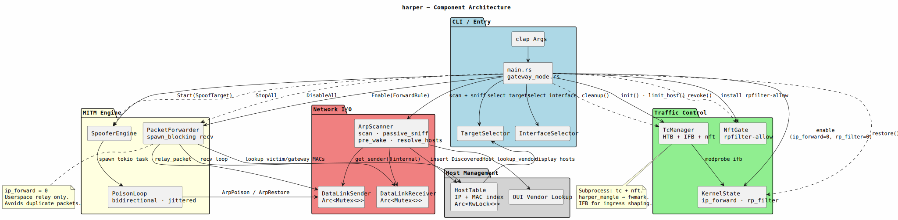

# harper — Implementation Status & Architecture

> This document reflects the **current state** of the codebase, not the original roadmap.
> Deviations from the original plan are noted where relevant.

---

## Implementation Status

### Phase 1 — Core Infrastructure - Completed

| Component | Source | Notes |
|---|---|---|
| ARP scanning (multi-pass, adaptive) | `src/network/scanner.rs` | Wired + wireless configs, pre-wake UDP probes, passive sniff |
| Host table management | `src/host/table.rs` | IP + MAC dual-index, reindex\_by\_ip, stale-host detection |
| ARP/Ethernet frame construction | `src/network/packet.rs` | ArpRequest, ArpPoison, ArpRestore, ArpReply — all pure, no heap alloc in hot path |
| Async runtime | `tokio` full + rt-multi-thread | spawn\_blocking for all pnet blocking calls |

> **Deviation:** `zerocopy` was planned for packet construction. `pnet`'s immutable fixed-size buffers (`[u8; 42]`) achieve the same zero-heap guarantee without an extra crate.

---

### Phase 2 — MITM Engine - Completed

| Component | Source | Notes |
|---|---|---|
| Bidirectional ARP poison loops | `src/spoofer/poison.rs` | Separate victim (4 s) and gateway (8 s) intervals with ±20% jitter |
| Spoofer engine | `src/spoofer/engine.rs` | Per-host oneshot stop channel, tokio task per victim |
| Packet forwarder | `src/forwarder/engine.rs` | Userspace relay with GSO/TSO software fragmentation, exponential retry |
| Host state transitions | `src/host/table.rs` → `HostState` | Discovered → Poisoning → Limited / Blocked, manual transitions |
| ARP restoration on teardown | `src/spoofer/poison.rs` → `restore()` | 5× restore packets with 100 ms gap |

> **Deviation:** `rust-fsm` was planned but not used. `HostState` is a plain enum with manual `update_state()` calls — sufficient for the current state space.
> NAT handling was listed as a goal but is not implemented; harper operates on a flat LAN where the gateway does NAT, not harper itself.

---

### Phase 3 — Traffic Control - Completed

| Component | Source | Notes |
|---|---|---|
| tc HTB shaping (upload + download) | `src/utils/tc.rs` → `TcManager` | Shells out to `tc` binary; covers init, limit\_host, remove\_host, cleanup |
| IFB ingress redirect | `TcManager::init()` | One catch-all u32 filter; correct architecture for pre-netfilter ingress |
| nftables packet marking | `TcManager::nft_*` | `harper_mangle` table, FORWARD chain rebuilt atomically on every change |
| Kernel state management | `src/main.rs` → `KernelState` | ip\_forward=0, rp\_filter=0, send\_redirects=0; restored on exit |
| NixOS rpfilter gate | `src/main.rs` → `NftGate` | Adds/removes accept rule in `nixos-fw rpfilter-allow` |
| Gateway mode | `src/gateway_mode.rs` | Shape clients on a network you host — no ARP poisoning, tc only |

> **Deviation:** `rtnetlink` is in `Cargo.toml` (pulled in transitively) but `TcManager` uses subprocess calls to `tc` and `nft` rather than raw netlink sockets. This trades runtime overhead for implementation simplicity and debuggability.
> `governor` (token bucket crate) was planned but rate limiting is handled entirely by the kernel's HTB qdisc — no userspace token bucket is needed.
> `nftables-rs` was planned; replaced by `nft -f -` stdin pipe calls, which are sufficient and require no additional dependency.

---

### Phase 4 — TUI & Monitoring - Partial

| Component | Status | Notes |
|---|---|---|
| CLI argument parsing | - Completed | `clap` derive in `src/main.rs` — interface, gateway, target, bandwidth, gateway-mode flags |
| Interactive shell loop | ❌ | Not implemented. Program runs until Ctrl-C or `q` + Enter |
| `ratatui` TUI / live graphs | ❌ | Not implemented |
| Per-host bandwidth stats | ❌ | `tc -s class show` output is not parsed or surfaced |
| Watch system (IP change detection) | ❌ | Not implemented |

---

### Phase 5 — Hardening - Completed

| Component | Source | Notes |
|---|---|---|
| TX buffer backpressure + retry | `src/forwarder/engine.rs` → `send_with_retry()` | Exponential backoff on ENOBUFS / WouldBlock, 4-retry cap |
| Scanner TX saturation guard | `src/network/scanner.rs` | Per-packet retry with backoff in the spawn\_blocking send loop |
| Jitter on poison intervals | `src/spoofer/poison.rs` → `jitter()` | ±20% on both victim and gateway intervals — breaks uniform-interval IDS signature |
| Graceful teardown | `main.rs` shutdown sequence | ForwarderCommand::DisableAll → SpooferCommand::StopAll → ARP restore wait → tc cleanup → kernel restore |
| IPv6 NDP spoofing | ❌ | Not implemented (was marked "bonus") |

---

### Added Since Original Plan

These components were not in the original roadmap but exist in the codebase:

| Component | Source | Why Added |
|---|---|---|
| Passive ARP sniffing | `ArpScanner::passive_sniff()` | Catches power-save devices that never reply to active probes |
| Pre-wake UDP probes | `ArpScanner::pre_wake()` | Nudges 802.11 sleeping radios before first ARP sweep |
| GSO/TSO software fragmentation | `forwarder/engine.rs` → `relay_ipv4()` | Handles NIC offload super-frames (up to 64 KB) that would cause EMSGSIZE |
| OUI vendor lookup | `src/utils/oui.rs` | Embedded IEEE database via `oui-data` crate |
| Gateway mode | `src/gateway_mode.rs` | Shape a network you host without any MITM |
| Wireless scan config | `ScanConfig::wireless()` | Higher pass count, longer inter-pass delay for 802.11 power-save |
| Comprehensive unit tests | All source files | `cargo llvm-cov nextest` coverage |

---

## Architecture



See the UML code in [Rev1 Archetecture](./rev1.puml)

---

## Key Safety Properties (Rust vs. Original Python Plan)

| Concern | How harper Handles It |
|---|---|
| Packet construction bounds | `pnet` fixed `[u8; 42]` buffers — no manual pointer arithmetic, no heap alloc |
| Concurrent host state | `Arc<RwLock<HostTable>>` — multiple readers, exclusive writer |
| Poison loop stop | `oneshot::Sender<()>` per loop — clean cancellation without abort |
| Forwarder stop | `AtomicBool` stop flag — the only reliable way to stop a `spawn_blocking` thread |
| Resource cleanup | `Drop` on `TcManager` and `PacketForwarder` — tc qdiscs and ip_forward restored even on panic |
| ARP cache restoration | 5× restore packets on poison stop — reduces risk of leaving victim disconnected |
| TX buffer saturation | Backpressure retry with exponential backoff in both scanner and forwarder |
| GSO super-frames | Software IPv4 fragmentation in `relay_ipv4()` — prevents EMSGSIZE from the NIC driver |

---

## Development

```bash
# Run all tests with coverage report
cargo llvm-cov nextest --ignore-filename-regex="rustc-" --html

# Watch mode during development
cargo watch -x check

# Build
cargo build --release

# Run (requires root for raw sockets)
sudo ./target/release/harper --help
sudo ./target/release/harper --gateway-mode          # shape a network you host
sudo ./target/release/harper -i eth0 -g 192.168.1.1  # MITM mode
```

```bash
# Squash commits before tagging v1
git rebase -i --root
git push origin main --force
```

---

## Remaining Work

| Item | Priority | Notes |
|---|---|---|
| Interactive shell / command loop | Medium | Replace Ctrl-C-only UX with a `scan`, `limit`, `free`, `hosts` command set |
| `ratatui` live bandwidth display | Low | Parse `tc -s class show` output per-victim |
| Watch system (auto re-limit on IP change) | Medium | Track by MAC, re-apply limit if victim reconnects with new IP |
| IPv6 NDP spoofing | Low | Requires ICMPv6 Neighbor Advertisement via pnet's ICMPv6 support |
| Replace tc subprocess calls with netlink | Low | `rtnetlink` is already a dependency — wire up `TcManager` to use it directly |
| Hostname resolution | Low | `DiscoveredHost::resolve_hostname()` is a stub |
